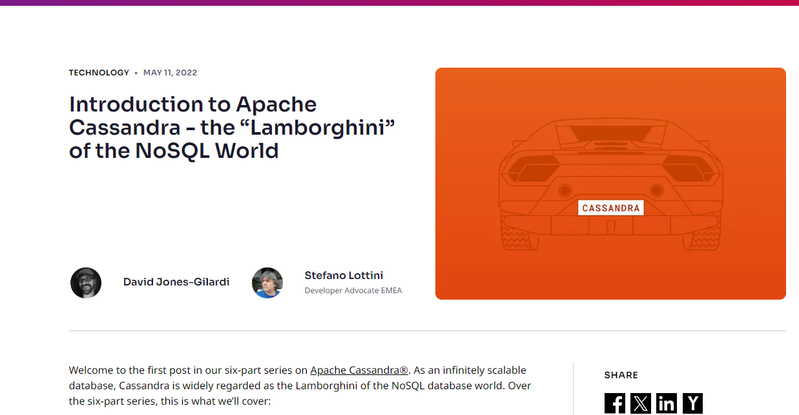
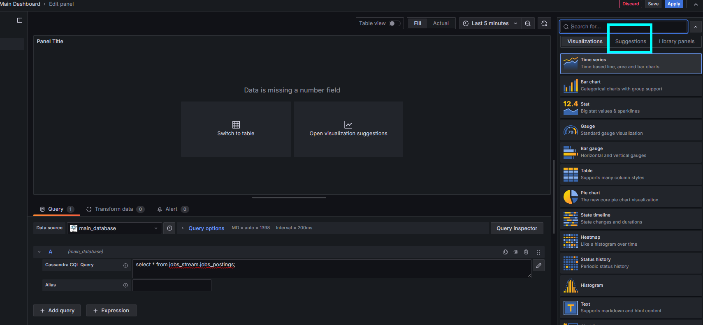
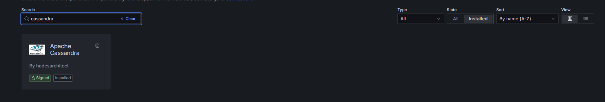
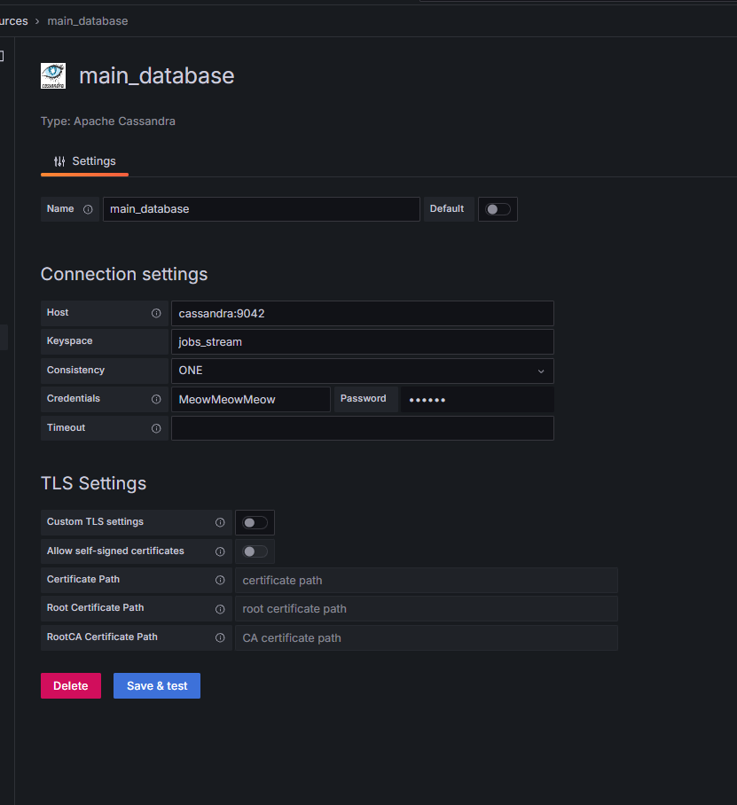
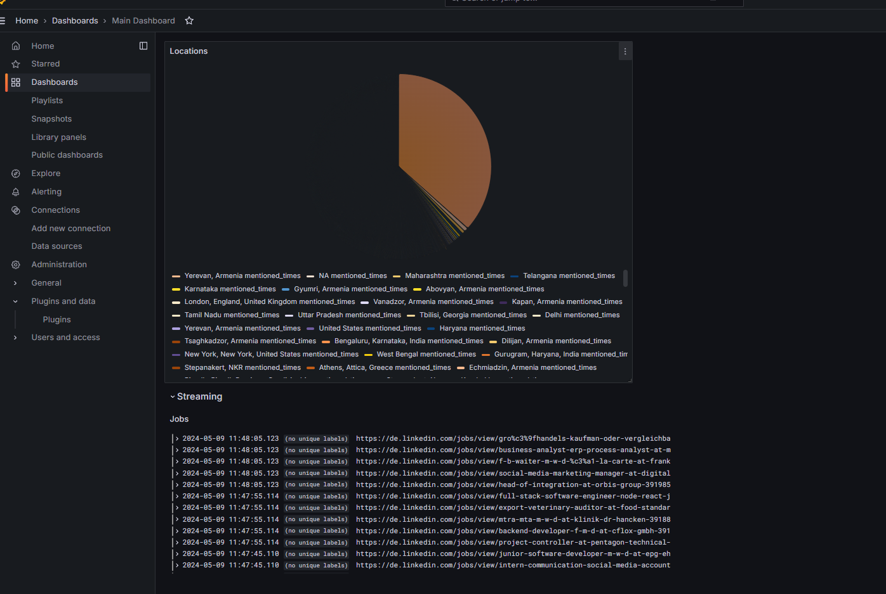

# Big Data Project

- Work Presented by `Yassine Belkhadem` and `Hani Haddad` 


This project is group project for the Big Data class GL4 - 2024 organized by Mrs Lilia Sfaxi. 


The project aims to collect data about job postings from different sources such as Linkedin, Twitter and on the net. It helps getting insights out of the gathered data. These insights are both Real-Time and Cold Data. 

Here is the architecture of the app ( As far as the TP 2 additions ) 


Now we aim to have such a dashboard as a final display: 


and thus the metrics we need to collect. 


## Metrics and Values


 | Metric Name                        | Description                 | How it will be calculated                    | Used dataset                                                                    |
 | ---------------------------------- | --------------------------- | -------------------------------------------- | ------------------------------------------------------------------------------- |
 | Average of the remote jobs allowed | -                           | Number of remote Jobs / Total Number of jobs | `job_postings.csv`                                                              |
 | Jobs / Company                     | Number of jobs per company  | Number of Jobs for company X                 | `linkeding_tech_jobs.csv`, `data.csv`                                           |
 | Number Jobs per Location           | Number of jobs per Location | Number of jobs for Location X                | `job_postings.csv`, `linkedin_tech_jobs.csv`, `job_data_merged.csv`, `data.csv` |
 | Skills of Jobs                     | All skills keywords         | Tokenizing Skills                            | `job_postings.csv`, `job_postings.csv`, `data.csv`                              |
 | Average Salary per job             |


## Data Layout 

In this section we outline the schema of each data source. 


### [Linkedin Job Postings 2023](./datasets/job_postings.csv)

- also [Skills](./datasets/skills.csv)
- also [Industries](./datasets/industries.csv)

https://www.kaggle.com/datasets/arshkonelinkedin-job-postings

`job_id,company_id,title,description,max_salary,med_salary,min_salary,pay_period,formatted_work_type,location,applies,original_listed_time,remote_allowed,views,job_posting_url,application_url,application_type,expiry,closed_time,formatted_experience_level,skills_desc,listed_time,posting_domain,sponsored,work_type,currency,compensation_type,scraped`

### [Linkedin Tech Jobs](./datasets/linkedin_tech_jobs.csv)

https://www.kaggle.com/datasets/joebeachcapital/linkedin-jobs

`Company_Name,Class,Designation,Location,Total_applicants,LinkedIn_Followers,Level,Involvement,Employee_count,Industry,PYTHON,C++,JAVA,HADOOP,SCALA,FLASK,PANDAS,SPARK,NUMPY,PHP,SQL,MYSQL,CSS,MONGODB,NLTK,TENSORFLOW,LINUX,RUBY,JAVASCRIPT,DJANGO,REACT,REACTJS,AI,UI,TABLEAU,NODEJS,EXCEL,POWER BI,SELENIUM,HTML,ML`


###  [NYC Job Posting](./datasets/nyc-jobs.csv)

https://www.kaggle.com/datasets/new-york-city/new-york-city-current-job-postings/data

`Job ID,Agency,Posting Type,# Of Positions,Business Title,Civil Service Title,Title Code No,Level,Job Category,Full-Time/Part-Time indicator,Salary`

## [Job Posting Dataset](./datasets/job_data_merged.csv)

- https://www.kaggle.com/datasets/moyukhbiswas/job-postings-dataset

`,Category,Workplace,Location,Department,Type`

### [Online Job Posting](./datasets/data.csv)

https://www.kaggle.com/datasets/madhab/jobposts

`"jobpost","date","Title","Company","AnnouncementCode","Term","Eligibility","Audience","StartDate","Duration","Location","JobDescription","JobRequirment","RequiredQual","Salary","ApplicationP","OpeningDate","Deadline","Notes","AboutC","Attach","Year","Month","IT"`

## Project Setup 


### Docker

The new version of the docker image that we used during the semester was broken and nothing worked. After 8 hours of failed attempts to fix it we decided to find the older version. ( Thanks for our classmate that pushed it to us )

The infrastructure has the following :

- `hadoop-master`: The main container we are using for pretty much everything. 
  - It has the scraper server // so we can access kafka via localhost :)
  - Hadoop, Hadoop HDFS
  - Apache kafka and zookeeper
  - Apache Spark 
  - Python environment 

> The hadoop-workerX are worker node for the hadoop cluster

- `cassandra`  The No-SQL database that we chose, why did we chose it? 
  - First, Grafana has a plugin that allows to use it as a data source.
  - Second, we stumbled on this cool post

  

- `grafana`: Well, it has the cool visualisation suggestins that by giving the query it suggests what graphs we can apply to it 



Here is the custom Dockerfile for the `hadoop-master`, it adds some deps and make it more useful 

```dockerfile
FROM ranimmbarek/hadoop-cluster

COPY mapred-site.xml /usr/local/hadoop/etc/hadoop/mapred-site.xml

COPY entrypoint.sh /
COPY ./dotfiles/.tmux.conf /root/.tmux.conf

RUN chmod +x /entrypoint.sh

RUN apt update && apt install -y netcat-traditional python3-pip tmux 

RUN pip3 install confluent_kafka flask cassandra-driver

CMD ["/entrypoint.sh"]
```

### Spark Batch

For batch processing, we tried to collect a bit of useful data of the datasets
We tried to work with java but it was quite painful. We are aware that pyspark code is converted to scala code before running and it's working in a kind of hookup with the java librairies. The errors in python are quite obscure as we have no idea which part of the scala code failedB

But python is too simple and straightforward, so we went with it.

#### Keywords Hunt


```py
from pyspark.sql import SparkSession
from pyspark.sql.functions import split, explode, col, desc, length
from pyspark import SparkContext

# Create a SparkSession
spark = SparkSession.builder \
    .appName("MostRepeatedWords") \
    .getOrCreate()

# Create a SparkContext
sc = SparkContext.getOrCreate()

# Load the dataset from HDFS
hdfs_path = "input/*.csv"
rdd = sc.textFile(hdfs_path)

# Convert RDD to DataFrame
df = spark.read.csv(rdd, header=True)

# Collect the column names
columns = df.columns

# Define a function to extract words from each column
def extract_words_from_column(df, column):
    return df.select(explode(split(col(column), " ")).alias("word")) \
             .filter(length(col("word")) >= 4)

# Iterate over columns, extract words, and union the results
words = None
for column in columns:
    if words is None:
        words = extract_words_from_column(df, column)
    else:
        words = words.union(extract_words_from_column(df, column))

# Count the occurrences of each word
word_counts = words.groupBy("word").count()

# Get the most repeated words in descending order
most_repeated_words = word_counts.orderBy(desc("count"))

most_repeated_words.show()

# Write output to HDFS
output_path = "output/most_repeated_words"
most_repeated_words.write.csv(output_path, header=True, mode='overwrite')

# Stop SparkSession and SparkContext
spark.stop()
sc.stop()
```


#### Finding which locations have more job opportunities


```python

from pyspark.sql import SparkSession

# Create a SparkSession
spark = SparkSession.builder \
    .appName("LocationsMentioned") \
    .getOrCreate()

# Load the dataset
df = spark.read.csv("input/linkedin_tech_jobs.csv", header=True)
df2 = spark.read.csv("input/job_data_merged.csv", header=True)
df3 = spark.read.csv("input/linkedin_tech_jobs.csv", header=True)
df4 = spark.read.csv("input/data.csv", header=True)

# Extract distinct locations
locations = df.select("location").distinct().union(df2.select("Location").distinct()).union(df3.select("Location").distinct()).union(df4.select("Location").distinct())

# Write output to a directory
locations.write.csv("output/locations", header=True, mode="overwrite")

# Stop SparkSession
spark.stop()
```


### Job Titles Finder


```py
from pyspark.sql import SparkSession
from pyspark.sql.functions import length

# Create a SparkSession
spark = SparkSession.builder.appName("Job Titles").getOrCreate()

# Load the dataset
df = spark.read.csv("input/job_postings.csv", header=True)
df2 = spark.read.csv("input/data.csv", header=True)

# Filter titles with less than 40 characters
filtered_titles = (
    df.filter(length(df["title"]) < 40)
    .select("title")
    .union(df2.filter(length(df2["Title"]) < 40).select("Title"))
)

filtered_titles.show()

# Write output to a directory
filtered_titles.write.csv("output/job_titles", mode="overwrite", header=True)

# Stop SparkSession
spark.stop()
```


### Streaming
We have found a cool SaaS that allows us to scrape Linkedin and gives back a json with many data

#### Data Extract

```
[{"publishedAt": "", "salary": "", "title": "Group Business Controller (m/w/d)", "jobUrl": "https://de.linkedin.com/jobs/view/group-business-controller-m-w-d-at-biomatch-3918859150?trk=public_jobs_topcard-title", "companyName": "Biomatch", "companyUrl": "https://de.linkedin.com/company/biomatchgmbh?trk=public_jobs_topcard-org-name", "location": "Maulburg, Baden-W\u00fcrttemberg, Germany", "postedTime": "8 hours ago", "applicationsCount": "Be among the first 25 applicants", "description": "F\u00fcr ein f\u00fchrendes Unternehmen aus der Maschinenbaubranche suchen wir einen engagierten Spezialisten im Bereich Business Controlling. In dieser Funktion sind Sie verantwortlich f\u00fcr die Koordination und Optimierung der Controlling-Prozesse in verschiedenen Gesch\u00e4ftsbereichen.\n\nAufgaben\n\n\n * Selbst\u00e4ndige Koordination und \u00dcberwachung der Controlling-Aktivit\u00e4ten in verschiedenen Ges
```

So we used it for streaming. We wrote a flask server that hits the SaaS Api and retrieve the data then stream it to spark where it gets treated

The JSON had a unique format, After a bit of googling we discovered structured streaming.

```py
from pyspark.sql import SparkSession
from pyspark.sql.functions import from_json, col, regexp_replace, udf, explode
from pyspark.sql.types import StructType, StructField, StringType, ArrayType

# Define the schema for the JSON data
schema = ArrayType(
    StructType(
        [
            StructField("publishedAt", StringType(), True),
            StructField("salary", StringType(), True),
            StructField("title", StringType(), True),
            StructField("jobUrl", StringType(), True),
            StructField("companyName", StringType(), True),
            StructField("companyUrl", StringType(), True),
            StructField("location", StringType(), True),
            StructField("postedTime", StringType(), True),
            StructField("applicationsCount", StringType(), True),
            StructField("description", StringType(), True),
            StructField("contractType", StringType(), True),
            StructField("experienceLevel", StringType(), True),
            StructField("workType", StringType(), True),
            StructField("sector", StringType(), True),
            StructField("companyId", StringType(), True),
            StructField("posterProfileUrl", StringType(), True),
            StructField("posterFullName", StringType(), True),
        ]
    )
)
```

It helps us verify and parse the data when received and allows us to use more spark functions that are meant for a specific types ( such as sum on int etc)

We wanted to extract many data from it and output in different ways.

```python
processed_data = (
    decoded_data.writeStream.format("json")
    .outputMode("append")
    .option("path", "full_data")
    .option("checkpointLocation", "checkpoint/streaming/linkedin")
    .start()
)

# Write job titles to job_titles_topic
job_titles_data = extracted_data.select("title")
job_titles_processed = (
    job_titles_data.selectExpr("title AS value")
    .writeStream.format("kafka")
    .option("kafka.bootstrap.servers", "hadoop-master:9092")
    .option("topic", "titles_topic")
    .option("checkpointLocation", "checkpoint/job_titles")
    .start()
)

# # Write locations to locations_topic
locations_data = extracted_data.select("location")
locations_processed = (
    locations_data.selectExpr("location AS value")
    .writeStream.format("kafka")
    .option("kafka.bootstrap.servers", "hadoop-master:9092")
    .option("topic", "locations_topic")
    .option("checkpointLocation", "checkpoint/locations")
    .start()
)
```


And then we can call another batch processing app that aggregates both data and insert it in the database.

For the project purpose and due to the short time we had, we added another spark app that inputs these values to the database after cleaning them.


```py
from pyspark.sql import SparkSession
from pyspark.sql.functions import col, from_json,explode,regexp_replace,udf,lower,current_timestamp

spark = SparkSession.builder \
    .master("local[1]")\
    .appName("JobPostingsProcessor") \
    .config("spark.jars.packages","com.datastax.spark:spark-cassandra-connector_2.12:3.5.0,org.apache.spark:spark-sql-kafka-0-10_2.12:3.5.0")\
    .config("spark.cassandra.connection.host", "cassandra") \
    .config("spark.cassandra.connection.port", "9042") \
    .getOrCreate()

from pyspark.sql.types import StructType, StructField, StringType, IntegerType,ArrayType

schema = ArrayType(StructType([
    StructField("publishedAt", StringType(), True),
    StructField("salary", StringType(), True),
    StructField("title", StringType(), True),
    StructField("jobUrl", StringType(), True),
    StructField("companyName", StringType(), True),
    StructField("companyUrl", StringType(), True),
    StructField("location", StringType(), True),
    StructField("postedTime", StringType(), True),
    StructField("applicationsCount", StringType(), True),
    StructField("description", StringType(), True),
    StructField("contractType", StringType(), True),
    StructField("experienceLevel", StringType(), True),
    StructField("workType", StringType(), True),
    StructField("sector", StringType(), True),
    StructField("companyId", StringType(), True),
    StructField("posterProfileUrl", StringType(), True),
    StructField("posterFullName", StringType(), True)
]))


streaming_data = (
    spark.readStream.format("kafka")
    .option("kafka.bootstrap.servers", "hadoop-master:9092")
    .option("subscribe", "job_data_topic")
    .option("startingOffsets", "earliest")
    .load()
)

parsed_data = streaming_data.select(
    from_json(col("value").cast("string"), schema).alias("data")
).select(explode("data").alias("job"))

# Clean the data by removing newlines and extra characters
cleaned_data = parsed_data.withColumn(
    "description", regexp_replace(col("job.description"), "\n|\r", " ")
).withColumn("description", regexp_replace(col("job.description"), "\\s+", " "))

# Extract valuable information
extracted_data = cleaned_data.select(
    lower(col("job.title")).alias("title"),
    lower(col("job.companyName")).alias("companyname"),
    lower(col("job.salary")).alias("salary"),
    lower(col("job.jobUrl")).alias("joburl"),
    lower(col("job.companyUrl")).alias("companyurl"),
    lower(col("job.location")).alias("location"),
    lower(col("job.postedTime")).alias("postedtime"),
    lower(col("job.sector")).alias("sector"),
    lower(col("job.description")).alias("description"),
    current_timestamp().alias("added_at")

)

# Define a UDF to decode Unicode characters
def decode_unicode(text):
    if text:
        return text.encode("utf-8").decode("unicode-escape")
    return text

decode_udf = udf(decode_unicode, StringType())

# Apply the UDF to decode Unicode characters in the relevant columns
decoded_data = (
    extracted_data.withColumn("title", decode_udf(col("title")))
    .withColumn("companyname", decode_udf(col("companyname")))
    .withColumn("location", decode_udf(col("location")))
    .withColumn("description", decode_udf(col("description")))
)

processed_data = (
    decoded_data.writeStream
    .format("org.apache.spark.sql.cassandra")
    .option("keyspace", "jobs_stream")
    .option("table", "jobs_postings")
    .option("checkpointLocation", "checkpoint/streaming/linkedin")
    .start()
)

# # Write locations to locations_topic
locations_data = extracted_data.select("location")
locations_processed = (
    locations_data.selectExpr("location AS value")
    .writeStream.format("kafka")
    .option("kafka.bootstrap.servers", "hadoop-master:9092")
    .option("topic", "locations_topic")
    .option("checkpointLocation", "checkpoint/locations")
    .start()
)

processed_data.awaitTermination()
```

### Visualazation

For visualisation, we added the grafana cassandra plugin, 


We added the connection to data sources



and we played with it till we created a simple dashboard



Here is a quick demo of the realtime visualtions where I run the scraper server and the spark app 


## Links

https://www.figma.com/file/mdUKKaUp1ryHJPNsVDnCkU/Architecture-Big-Data?type=whiteboard&node-id=0%3A1&t=FIU3ismwkiteAQYB-1

